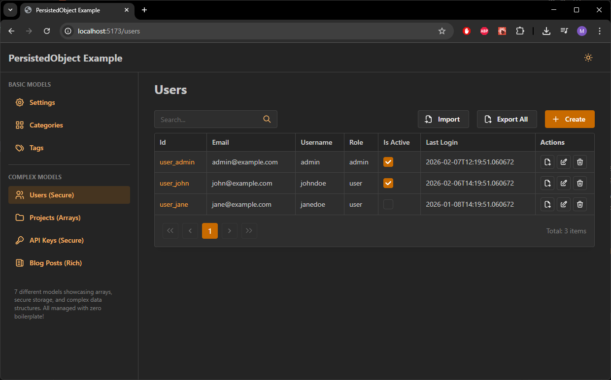

# PersistedObject - Zero-Boilerplate CRUD for FastAPI

**Production-ready Python package for building type-safe CRUD APIs with automatic endpoint generation.**

[](https://www.python.org/downloads/)
[](https://fastapi.tiangolo.com)
[](LICENSE)

## Philosophy

- **Zero Boilerplate**: Define a model, get 10 CRUD endpoints automatically
- **Type-Safe**: Pydantic models with full type inference
- **Production-Ready**: Multiple column types, timestamps, encryption, database optimizations
- **Developer Time-Saver**: Perfect for settings, configurations, and secondary data structures

## Quick Example

```python
from persisted_object import (
    PersistedObject, 
    register_persisted_model,
    create_crud_router,
    Store,
    KeyField,
    TitleField
)

# 1. Define your model
@register_persisted_model
class Category(PersistedObject):
    __table_name__ = "categories"
    __primary_key__ = "id"
    __indexed_fields__ = ["id", "slug", "is_active"]
    __unique_fields__ = ["slug"]
    
    id: str = KeyField(description="Category ID")
    slug: str = KeyField(description="URL slug (unique)")
    title: str = TitleField(description="Category title")
    is_active: bool = True  # -> Boolean column in DB
    sort_order: int = 0     # -> Integer column in DB

# 2. Create router (10 endpoints automatically!)
app.include_router(
    create_crud_router(
        model=Category,
        store=Store(Category),
        prefix="/api/categories",
        get_db=get_db
    )
)
```

**That's it!** You now have:
- `GET /api/categories` - List with pagination & filtering
- `GET /api/categories/{id}` - Get single item
- `POST /api/categories` - Create
- `PUT /api/categories/{id}` - Update
- `DELETE /api/categories/{id}` - Delete
- `GET /api/categories/schema` - JSON Schema
- Plus 4 more endpoints (create/edit schemas, import/export)

## Features

### Core Features
- **Router Factory** - 10 CRUD endpoints in 1 line of code
- **Multiple Column Types** - Boolean, Integer, DateTime, String (not just String!)
- **Automatic Timestamps** - `created_at` and `updated_at` on every table
- **Composite Unique Constraints** - Multi-field uniqueness (e.g., `"first_name,last_name"`)
- **Field Helpers** - Semantic field definitions with automatic constraints
- **Lifecycle Hooks** - before_create, after_update, etc.
- **Permissions System** - CrudPermissions for authorization
- **Async Support** - Full async/await API

### Advanced Features
- **Table Caching** - Optimized table creation
- **Database Optimizations** - MySQL (InnoDB), SQLite, PostgreSQL, MSSQL ready
- **JSON Encryption Extension** - Optional Fernet encryption (requires `cryptography`)
- **OpenAPI Integration** - Automatic schema generation

## Installation

```bash
# Basic installation
pip install bazlama-persisted-object

# With encryption support
pip install bazlama-persisted-object[encryption]
# or
pip install bazlama-persisted-object cryptography
```

## Documentation

### Quick Links
- [Python Package Documentation](./python/README.md) - Complete API reference
- [React Package Documentation](./react/README.md) - React components & hooks
- [Example Project](./example/README.md) - Full working example with 6 models
- [SQLAlchemy Models](./python/src/sqlalchemy_models.py) - Advanced internals

### Key Concepts

#### 1. Multiple Column Types
```python
@register_persisted_model
class Event(PersistedObject):
    __table_name__ = "events"
    __primary_key__ = "id"
    __indexed_fields__ = ["id", "event_date", "is_published", "priority"]
    
    id: str = KeyField()
    event_date: datetime = ...      # -> DateTime column
    is_published: bool = False      # -> Boolean column
    priority: int = 0               # -> Integer column
    title: str = TitleField()       # -> String(400) column
```

#### 2. Automatic Timestamps
```python
# Every table automatically gets:
created_at: DateTime  # Set on insert
updated_at: DateTime  # Updated on every change

# Query by timestamps
store.list(db, order_by="-created_at")  # Newest first
```

#### 3. Composite Unique Constraints
```python
@register_persisted_model
class Person(PersistedObject):
    __unique_fields__ = [
        "email",                    # Single field unique
        "first_name,last_name"      # Composite unique
    ]
```

#### 4. Field Helpers
```python
from persisted_object import (
    IDField,           # max_length=26 (ULID)
    KeyField,          # max_length=200 (slugs, names)
    TitleField,        # max_length=400 (titles)
    DescriptionField,  # max_length=800 (descriptions)
    ContentField,      # max_length=4000 (content)
)

class Post(PersistedObject):
    id: str = IDField()
    slug: str = KeyField()
    title: str = TitleField()
    excerpt: str = DescriptionField()
    content: str = ContentField()
```

#### 5. Lifecycle Hooks
```python
from persisted_object import CrudHooks

class CategoryHooks(CrudHooks):
    async def before_create(self, data: dict) -> dict:
        # Auto-generate slug from title
        data["slug"] = data["title"].lower().replace(" ", "-")
        return data
    
    async def after_delete(self, id: str) -> None:
        # Clean up related data
        await cleanup_category_references(id)

router = create_crud_router(
    model=Category,
    store=store,
    prefix="/api/categories",
    hooks=CategoryHooks()
)
```

#### 6. Optional Encryption
```python
# Install: pip install cryptography

# Set environment variables
export PERSISTED_OBJECT_ENCRYPTION_KEY="your-key"
export PERSISTED_OBJECT_ENCRYPTION_SALT="your-salt"

@register_persisted_model
class Secret(PersistedObject):
    __table_name__ = "secrets"
    __primary_key__ = "id"
    __encrypt_json__ = True  # Encrypt json_data column
    
    id: str = KeyField()
    api_key: str = PasswordField()
    credentials: dict = {}
```

## Project Structure

```
bazlama-persisted-object/
├── python/                      # PyPI package
│   ├── src/
│   │   ├── __init__.py
│   │   ├── base.py              # PersistedObject base class
│   │   ├── store.py             # CRUD operations
│   │   ├── router.py            # Router Factory
│   │   ├── hooks.py             # Lifecycle hooks
│   │   ├── fields.py            # Field helpers
│   │   ├── sqlalchemy_models.py # Advanced table creation
│   │   ├── registry.py          # Model registry
│   │   └── exceptions.py        # Custom exceptions
│   ├── pyproject.toml
│   └── README.md
├── react/                       # npm package (@persisted-object/react)
│   ├── src/
│   │   ├── components/          # CrudPage, DataTable, JsonSchemaForm
│   │   ├── hooks/               # useCrudList, useCrudMutation, etc.
│   │   └── api/                 # CrudApiClient
│   ├── package.json
│   └── README.md
└── example/
    ├── backend/                 # Working example (FastAPI)
    │   ├── main.py              # Router Factory usage
    │   ├── models.py            # 6 example models
    │   └── database.py          # SQLite setup
    ├── frontend/                # Working example (React)
    └── README.md
```

## Example Project

A complete working example with 6 different models demonstrating all features:

```bash
cd example/backend
python -m venv venv
source venv/bin/activate  # Windows: venv\Scripts\activate
pip install -r requirements.txt
python main.py
```

Visit http://localhost:8000/docs to explore the auto-generated API!

### Screenshots

<p align="center">
  
</p>

<p align="center">
  
</p>

## Links

- [Python Package Documentation](./python/README.md) - Complete API reference
- [React Package Documentation](./react/README.md) - React components & hooks
- [Example Project](./example/README.md) - Working example with tutorials
- [GitHub Repository](https://github.com/qmex/bazlama-persisted-object)

## Contributing

Contributions welcome! Please read [CONTRIBUTING.md](CONTRIBUTING.md) first.

## License

MIT License - see [LICENSE](LICENSE) file for details.
